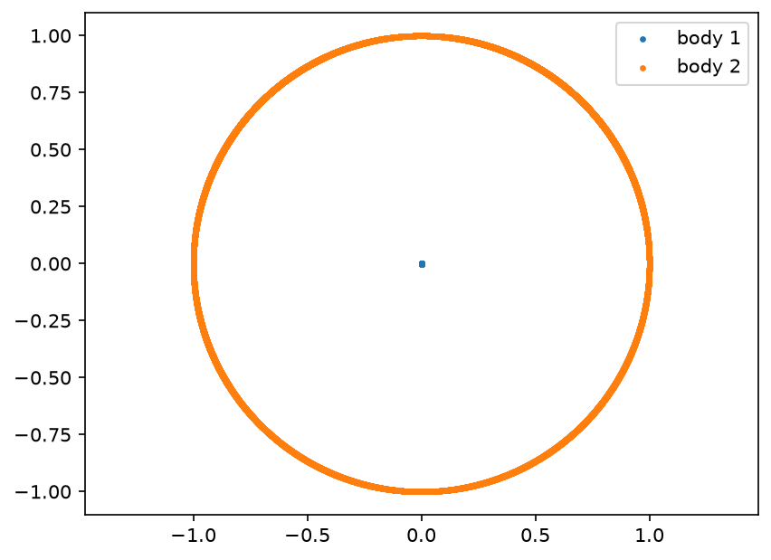

# Stellaric

Stellaric is an N-body simulator. Its goal is to simulate bodies with mass
interacting with each other under gravity.

> **Work in progress.** This README is temporary and will be rewritten once
> any major features or structural changes land.

## Project structure

This is a Cargo workspace made up of two crates:

```
stellaric/
├── Cargo.toml              # workspace manifest
├── stellaric-core/         # simulation engine
│   ├── Cargo.toml
│   └── src/
│       ├── lib.rs
│       ├── vector.rs       # Vector3
│       └── physics.rs      # Body, Sandbox, gravity/integration
└── stellaric-visual/       # simulation runner / output
    ├── Cargo.toml
    └── src/
        └── main.rs         # sets up bodies, runs the sim, writes CSV
```

- `stellaric-core` — the simulation engine. Defines `Vector3`, `Body`, and
  `Sandbox`, and implements the physics (gravitational force, acceleration,
  and position/velocity integration) used to step the simulation forward.
- `stellaric-visual` — the entry point that sets up a system of bodies, runs the simulation for a number of steps,
  and outputs the results.

> **Heads up:** the `Vector3` type and its math (add, subtract, scale,
> divide, dot product, cross product) are implemented from scratch in
> `vector.rs` — there is no external linear algebra/vector crate involved.
> The only third-party dependency in the workspace is `approx`, used for
> floating-point comparisons. If you spot any issues with any of the
> implementations, feel free to mention them.


## Units and the gravitational constant (G)

Stellaric has no built-in units. Masses, positions, velocities, and the time
step are plain numbers — the value of `G` decides what units they represent.
Every input must use the same unit system as the chosen `G`.

| Unit system | Mass | Distance | Time | `G` |
|---|---|---|---|---|
| Natural (N-body) units | arbitrary | arbitrary | arbitrary | `1.0` |
| Astronomical units | solar masses | AU (Earth–Sun distance) | years | `4π² ≈ 39.478` |
| SI units | kilograms | metres | seconds | `6.674e-11` |

- **Natural units (`G = 1`)** — used for testing and for known solutions
  such as the three-body figure-eight orbit. Results describe a whole
  family of real systems and can be rescaled to any size.
- **Astronomical units (`G = 4π²`)** — suited to the solar system model.
  Values stay close to 1, and results read directly in real-world terms:
  Earth completes one orbit every 1.0 time units.
- **SI units (`G = 6.674e-11`)** — works with raw physical measurements,
  but needs a much larger time step (e.g. `3600.0` seconds for planetary
  orbits), and the wide range of magnitudes costs floating-point precision.

`G` is currently a constant in `stellaric-core/src/physics.rs`, and the
time step is passed to `Sandbox::new` in `stellaric-visual/src/main.rs`.
When switching unit systems, change both.

> **Heads up:** mixing unit systems is the easiest way to get meaningless
> results — for example, `G = 1` with masses in kilograms. If bodies fly
> apart or collapse unexpectedly, check the units first.


## Visual output

The visual side of the project is currently limited to writing simulation
data out to a CSV file (`orbit_data.csv`), with one row per body per
simulation step (`step,body,x,y,z`). There is no built-in plotting or
rendering yet — the CSV is meant to be loaded into an external tool (e.g.
a Python/matplotlib script, a spreadsheet, etc.) to visualize the orbits.

### Simple Example: star and planet in a circular orbit

A light planet orbiting a heavy star, using natural units (`G = 1.0`):

```rust
let star   = Body::new(1.0,   Vector3{x: 0.0, y: 0.0, z: 0.0}, Vector3{x: 0.0, y: -0.001, z: 0.0});
let planet = Body::new(0.001, Vector3{x: 1.0, y: 0.0, z: 0.0}, Vector3{x: 0.0, y:  1.0,   z: 0.0});
```

The simulation was run for around 20,000 steps with a time step of
`dt = 0.0005`.  

Plotting the CSV with matplotlib gives:



Body 1 (the star) stays almost fixed at the centre, while body 2 (the
planet) orbits around body 1.

## Running

```bash
cargo run -p stellaric-visual
```

This will run the simulation and produce `orbit_data.csv` in the working
directory.

